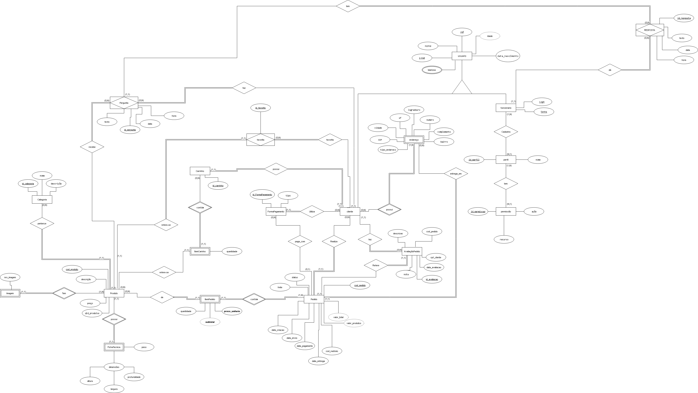

# 3 - Projeto Conceitual

## 3.1. Modelo Entidade-Relacionamento(MER)

## 3.2. Dicionário de Dados

| **Entidade** | **Atributo** | **Tipo de Dado** | **Restrições** |
|---|---|---|---|
| USUARIO | cpf | CHAR(11) | PK, único, não nulo |
| USUARIO | nome | VARCHAR(100) | não nulo |
| USUARIO | email | VARCHAR(100) | único, não nulo |
| USUARIO | telefone | VARCHAR(15) | opcional |
| USUARIO | data_nascimento | DATE | opcional |
| USUARIO | idade | INT | derivado de data_nascimento |
| CLIENTE | cpf_usuario | CHAR(11) | PK, FK → USUARIO(cpf), não nulo |
| FUNCIONARIO | cpf_usuario | CHAR(11) | PK, FK → USUARIO(cpf), não nulo |
| FUNCIONARIO | login | VARCHAR(30) | único, não nulo |
| FUNCIONARIO | senha | VARCHAR(50) | não nulo |
| FUNCIONARIO | cod_perfil | INT | FK → PERFIL(id_perfil), não nulo |
| PERFIL | id_perfil | INT | PK, auto incremento, não nulo |
| PERFIL | nome | VARCHAR(50) | único, não nulo |
| PERMISSAO | id_permissao | INT | PK, auto incremento, não nulo |
| PERMISSAO | acao | VARCHAR(50) | não nulo |
| PERMISSAO | recurso | VARCHAR(100) | não nulo |
| ENDERECO | cpf_usuario | CHAR(11) | PK (composta), FK → USUARIO(cpf), não nulo |
| ENDERECO | tipo_endereco | ENUM('residencial','comercial','outro') | PK (composta), não nulo |
| ENDERECO | logradouro | VARCHAR(150) | não nulo |
| ENDERECO | numero | VARCHAR(10) | não nulo |
| ENDERECO | complemento | VARCHAR(50) | opcional |
| ENDERECO | bairro | VARCHAR(60) | não nulo |
| ENDERECO | cidade | VARCHAR(60) | não nulo |
| ENDERECO | uf | CHAR(2) | não nulo, CHECK (UF válida) |
| ENDERECO | cep | CHAR(8) | não nulo |
| FORMA_PAGAMENTO | id_FormaPagamento | INT | PK, auto incremento, não nulo |
| FORMA_PAGAMENTO | tipo | ENUM('cartão','pix','boleto') | não nulo |
| FORMA_PAGAMENTO | cpf_cliente | CHAR(11) | FK → CLIENTE(cpf_usuario), não nulo |
| CATEGORIA | id_categoria | INT | PK, auto incremento, não nulo |
| CATEGORIA | nome | VARCHAR(100) | único, não nulo |
| CATEGORIA | descricao | VARCHAR(255) | opcional |
| PRODUTO | cod_produto | INT | PK, auto incremento, não nulo |
| PRODUTO | descricao | VARCHAR(255) | não nulo |
| PRODUTO | preco | DECIMAL(10,2) | não nulo, CHECK (preco > 0) |
| PRODUTO | qtd_produtos | INT | não nulo, CHECK (qtd_produtos ≥ 0) |
| PRODUTO | id_categoria | INT | FK → CATEGORIA(id_categoria), não nulo |
| IMAGEM | nro_imagem | INT | PK, auto incremento, não nulo |
| IMAGEM | cod_produto | INT | FK → PRODUTO(cod_produto), não nulo |
| FICHA_TECNICA | cod_produto | INT | PK, FK → PRODUTO(cod_produto), único, não nulo |
| FICHA_TECNICA | cor | VARCHAR(30) | opcional |
| FICHA_TECNICA | tensao | VARCHAR(10) | opcional |
| FICHA_TECNICA | peso | DECIMAL(6,2) | opcional, CHECK (peso ≥ 0) |
| FICHA_TECNICA | material | VARCHAR(50) | opcional |
| FICHA_TECNICA | altura | DECIMAL(6,2) | opcional, CHECK (altura ≥ 0) |
| FICHA_TECNICA | largura | DECIMAL(6,2) | opcional, CHECK (largura ≥ 0) |
| FICHA_TECNICA | profundidade | DECIMAL(6,2) | opcional, CHECK (profundidade ≥ 0) |
| CARRINHO | id_carrinho | INT | PK, auto incremento, não nulo |
| CARRINHO | cpf_cliente | CHAR(11) | FK → CLIENTE(cpf_usuario), único, não nulo |
| ITEM_CARRINHO | id_carrinho | INT | PK (composta), FK → CARRINHO(id_carrinho), não nulo |
| ITEM_CARRINHO | cod_produto | INT | PK (composta), FK → PRODUTO(cod_produto), não nulo |
| ITEM_CARRINHO | quantidade | INT | não nulo, CHECK (quantidade ≥ 1) |
| PEDIDO | cod_pedido | INT | PK, auto incremento, não nulo |
| PEDIDO | data_criacao | DATETIME | não nulo |
| PEDIDO | data_envio | DATETIME | opcional |
| PEDIDO | data_pagamento | DATETIME | opcional |
| PEDIDO | data_entrega | DATETIME | opcional |
| PEDIDO | status | ENUM('pendente','pago','enviado','entregue','cancelado') | não nulo |
| PEDIDO | frete | DECIMAL(10,2) | não nulo, CHECK (frete ≥ 0) |
| PEDIDO | cod_rastreio | VARCHAR(50) | opcional |
| PEDIDO | valor_produtos | DECIMAL(10,2) | derivado (soma dos itens) |
| PEDIDO | valor_total | DECIMAL(10,2) | derivado (valor_produtos + frete) |
| ITEM_PEDIDO | cod_pedido | INT | PK (composta), FK → PEDIDO(cod_pedido), não nulo |
| ITEM_PEDIDO | cod_produto | INT | PK (composta), FK → PRODUTO(cod_produto), não nulo |
| ITEM_PEDIDO | quantidade | INT | não nulo, CHECK (quantidade ≥ 1) |
| ITEM_PEDIDO | preco_unitario | DECIMAL(10,2) | não nulo, CHECK (preco_unitario > 0) |
| ITEM_PEDIDO | subtotal | DECIMAL(10,2) | derivado (quantidade × preco_unitario) |
| AVALIACAO_PEDIDO | id_avaliacao | INT | PK, auto incremento, não nulo |
| AVALIACAO_PEDIDO | cod_pedido | INT | FK → PEDIDO(cod_pedido), não nulo |
| AVALIACAO_PEDIDO | cpf_cliente | CHAR(11) | FK → CLIENTE(cpf_usuario), não nulo |
| AVALIACAO_PEDIDO | nota | INT | não nulo, CHECK (nota BETWEEN 1 AND 5) |
| AVALIACAO_PEDIDO | descricao | TEXT | opcional |
| AVALIACAO_PEDIDO | data_avaliacao | DATE | não nulo |
| PERGUNTA | id_pergunta | INT | PK, auto incremento, não nulo |
| PERGUNTA | texto | TEXT | não nulo |
| PERGUNTA | data | DATE | não nulo |
| PERGUNTA | hora | TIME | não nulo |
| PERGUNTA | cpf_cliente | CHAR(11) | FK → CLIENTE(cpf_usuario), não nulo |
| PERGUNTA | cod_produto | INT | FK → PRODUTO(cod_produto), não nulo |
| RESPOSTA | id_resposta | INT | PK, auto incremento, não nulo |
| RESPOSTA | texto | TEXT | não nulo |
| RESPOSTA | data | DATE | não nulo |
| RESPOSTA | hora | TIME | não nulo |
| RESPOSTA | id_pergunta | INT | FK → PERGUNTA(id_pergunta), não nulo |
| RESPOSTA | cpf_funcionario | CHAR(11) | FK → FUNCIONARIO(cpf_usuario), não nulo |
| FAVORITO | id_favorito | INT | PK, auto incremento, não nulo |
| FAVORITO | cpf_cliente | CHAR(11) | FK → CLIENTE(cpf_usuario), não nulo |
| FAVORITO | cod_produto | INT | FK → PRODUTO(cod_produto), não nulo |
| FAVORITO | data_favorito | DATE | opcional |
